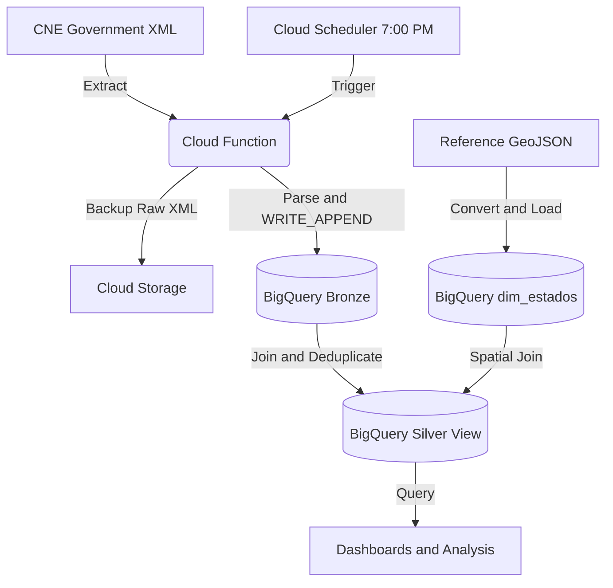

# Mexico Gas Prices - Serverless Data Pipeline


Automated serverless pipeline that ingests daily gasoline prices from Mexico's Comision Nacional de Energia (CNE), archives the raw XML, loads Bronze tables in BigQuery, and exposes a cleaned Silver view for analytics.

## Overview

The pipeline uses a simple Medallion pattern:

- Bronze: append-only raw ingestion tables for `prices` and `places`
- Silver: a deduplicated analytical view enriched with state geometry
- Storage: raw XML archived in Cloud Storage for replay and auditing
- Scheduling: Cloud Scheduler triggers the Cloud Function daily

The currently deployed scheduler job `cne-daily-trigger` runs on `0 19 * * *` in the `America/Mexico_City` time zone.



## Repository Structure

```text
.
├── README.md
├── main.py
├── requirements.txt
├── data/
│   ├── reference/
│   │   └── mx-estados.json
│   └── generated/
│       ├── mx-estados.csv
│       └── mx-estados-validado.csv
├── scripts/
│   └── geo/
│       ├── download_wgs84.py
│       ├── geojson_to_csv.py
│       └── validate_wgs84.py
└── sql/
    ├── 01_dim_estados.sql
    └── 02_vw_silver.sql
```

## Runtime Components

### Cloud Function

- File: `main.py`
- Entrypoint: `ingest_cne_data`
- Responsibility:
  - Determine the business date in `America/Mexico_City`
  - Download the `prices` and `places` XML feeds
  - Save raw XML under partitioned Cloud Storage paths
  - Append parsed rows into BigQuery Bronze tables

### Geo Preparation Scripts

These scripts support the spatial dimension used by the Silver view:

- `scripts/geo/download_wgs84.py`
  - Downloads the canonical Mexico GeoJSON into `data/reference/mx-estados.json`
- `scripts/geo/validate_wgs84.py`
  - Validates coordinate ranges and writes `data/generated/mx-estados-validado.csv`
- `scripts/geo/geojson_to_csv.py`
  - Converts the reference GeoJSON into `data/generated/mx-estados.csv`

### SQL Assets

- `sql/01_dim_estados.sql`
  - Builds the `dim_estados` table from the CSV-loaded raw table
- `sql/02_vw_silver.sql`
  - Builds the analytical Silver view with deduplication and geospatial joins

## Data Folder Policy

- `data/reference/`
  - Versioned source data required by the repo
- `data/generated/`
  - Reproducible outputs created by helper scripts
  - Ignored by Git

If you rerun the geo scripts, they will always write to the updated repo-relative paths, regardless of your current working directory.

## Prerequisites

- Python 3.9+
- Google Cloud SDK with access to the target project
- A Google Cloud project with:
  - Cloud Functions
  - Cloud Scheduler
  - Cloud Storage
  - BigQuery

Install local dependencies:

```bash
python3 -m venv venv
source venv/bin/activate
pip install -r requirements.txt
```

## Environment Variables

The Cloud Function expects:

```bash
export PROJECT_ID="your-gcp-project-id"
export BUCKET_NAME="your-bucket-name"
```

## Local Validation

### Validate the Geo Workflow

Run the helper scripts from any folder:

```bash
python3 scripts/geo/download_wgs84.py
python3 scripts/geo/validate_wgs84.py
python3 scripts/geo/geojson_to_csv.py
```

Expected outputs:

- `data/reference/mx-estados.json`
- `data/generated/mx-estados-validado.csv`
- `data/generated/mx-estados.csv`

### Validate Python Syntax

```bash
python3 -c "import ast, pathlib; files=['main.py','scripts/geo/download_wgs84.py','scripts/geo/validate_wgs84.py','scripts/geo/geojson_to_csv.py']; [ast.parse(pathlib.Path(f).read_text(encoding='utf-8'), filename=f) for f in files]; print('syntax ok')"
```

## BigQuery Setup

1. Load the validated or generated CSV into a raw staging table in BigQuery.
2. Run `sql/01_dim_estados.sql` to create `dim_estados`.
3. Run `sql/02_vw_silver.sql` to create the Silver analytical view.

The SQL scripts currently reference the project `cne-pipeline-mx-2026`. Update those identifiers if you deploy into a different project.

## Deployment Notes

The repo is structured so only runtime code is packaged for the Cloud Function. Helper scripts, SQL files, and local data folders are excluded by `.gcloudignore`.

Example deployment shape:

```bash
gcloud functions deploy YOUR_FUNCTION_NAME \
  --gen2 \
  --runtime=python311 \
  --region=us-central1 \
  --source=. \
  --entry-point=ingest_cne_data \
  --trigger-http \
  --set-env-vars=PROJECT_ID=YOUR_PROJECT_ID,BUCKET_NAME=YOUR_BUCKET
```

Replace the function name, runtime, and project-specific values with the settings used in your environment.

## Operational Validation

To trigger the production scheduler job manually:

```bash
gcloud scheduler jobs run cne-daily-trigger --location=us-central1
```

This confirms the scheduler can still invoke the deployed pipeline after repository changes. Because the scheduler targets deployed cloud resources, this check validates the live environment rather than only the local repo.

## Idempotency and Data Quality

- Raw XML is archived before parsing.
- Bronze tables use append-only loads.
- The Silver view removes same-day duplicates with `ROW_NUMBER()`.
- The Silver view filters obviously invalid prices and requires valid coordinates for the spatial join.
- Business date logic accounts for the source system publishing after 18:00 in Mexico City time.

## Troubleshooting

- If `validate_wgs84.py` reports invalid coordinate ranges, refresh the reference file with `download_wgs84.py`.
- If local scripts fail from a different working directory, confirm you are using the new files under `scripts/geo/`.
- If the scheduler job runs but ingestion fails, inspect Cloud Function logs and BigQuery load job errors in Google Cloud.
