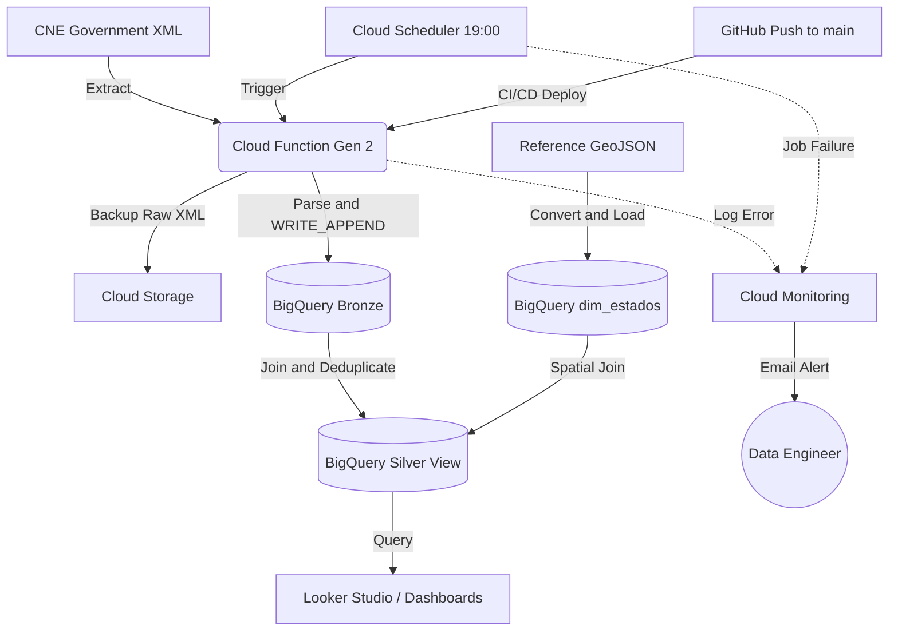

# Mexico Gas Prices — Serverless Data Pipeline


Automated serverless data pipeline that ingests daily gasoline prices from Mexico's Comisión Nacional de Energía (CNE), archives raw XML files, loads Bronze tables into BigQuery, and exposes a cleaned Silver analytical view for reporting and analytics.

The solution includes automated CI/CD deployments, real-time observability alerts, data quality controls, and FinOps guardrails to keep cloud costs predictable.

---

## Table of Contents

- [Overview](#overview)
- [Architecture](#architecture)
- [Repository Structure](#repository-structure)
- [DevOps and CI/CD](#devops-and-cicd)
- [Observability and Alerting](#observability-and-alerting)
- [FinOps and Cost Control](#finops-and-cost-control)
- [Runtime Components](#runtime-components)
- [Data Folder Policy](#data-folder-policy)
- [Prerequisites](#prerequisites)
- [Local Setup](#local-setup)
- [BigQuery Setup](#bigquery-setup)
- [Idempotency and Data Quality](#idempotency-and-data-quality)
- [Business Date Logic](#business-date-logic)
- [Manual Alert Deployment](#manual-alert-deployment)
- [Future Improvements](#future-improvements)

---

## Overview

This project follows a Medallion architecture pattern using fully managed Google Cloud services.

| Layer | Purpose |
|---|---|
| Bronze | Append-only raw ingestion tables for `prices` and `places`. |
| Silver | Deduplicated analytical view enriched with state geometry. |
| Storage | Raw XML files archived in Cloud Storage for replay and auditability. |
| Scheduling | Cloud Scheduler triggers the Cloud Function daily at `19:00` in `America/Mexico_City`. |
| CI/CD | GitHub Actions deploys the Gen 2 Cloud Function after changes are merged into `main`. |
| Observability | Cloud Monitoring alerts notify the Data Engineer when the function or scheduler fails. |

---

## Architecture



---

## Repository Structure

```text
.
├── .github/
│   └── workflows/
│       └── deploy.yml              # CI/CD GitHub Actions workflow
├── infra/
│   ├── alerta-funcion.json         # Cloud Monitoring policy for Cloud Function errors
│   └── alerta-scheduler.json       # Cloud Monitoring policy for Scheduler failures
├── main.py                         # Cloud Function entrypoint
├── requirements.txt                # Python dependencies
├── data/
│   ├── reference/
│   │   └── mx-estados.json         # Versioned Mexico state GeoJSON reference file
│   └── generated/
│       ├── mx-estados.csv          # Generated state geometry CSV
│       └── mx-estados-validado.csv # Validated state geometry CSV
├── scripts/
│   └── geo/
│       ├── download_wgs84.py       # Downloads canonical Mexico GeoJSON
│       ├── geojson_to_csv.py       # Converts GeoJSON into CSV
│       └── validate_wgs84.py       # Validates coordinate ranges
└── sql/
    ├── 01_dim_estados.sql          # Creates state dimension table
    └── 02_vw_silver.sql            # Creates Silver analytical view
```

---

## DevOps and CI/CD

Deployments are automated through GitHub Actions.

A push or merge into the `main` branch can trigger the deployment workflow for the Cloud Function, especially when changes are made to files such as:

- `main.py`
- `requirements.txt`
- `.github/workflows/deploy.yml`

### Required GitHub Secret

Create the following repository secret:

| Secret Name | Description |
|---|---|
| `GCP_SA_KEY` | JSON credentials for the Google Cloud deployment service account. |

### Required IAM Roles

The deployment service account should have the following IAM roles:

| Role | Purpose |
|---|---|
| Cloud Functions Developer | Deploy and manage Cloud Functions. |
| Service Account User | Allow the deployment process to execute using the runtime service account. |
| Artifact Registry Repository Administrator | Manage build artifacts and container images. |
| Cloud Run Admin | Manage the Cloud Run service behind the Gen 2 Cloud Function. |

> Review `.github/workflows/deploy.yml` for the exact deployment steps.

---

## Observability and Alerting

The project uses Google Cloud Monitoring to detect failures and notify the Data Engineer through email alerts.

Alerting policies are stored in the `infra/` folder as JSON files.

| Alert Policy | File | Purpose |
|---|---|---|
| Cloud Function Error Alert | `infra/alerta-funcion.json` | Monitors `cloud_run_revision` logs and triggers an alert when the Python ingestion process logs an error. |
| Scheduler Failure Alert | `infra/alerta-scheduler.json` | Monitors `cloud_scheduler_job` logs and triggers an alert if the daily scheduler execution fails. |

Typical failure scenarios include:

- CNE endpoint unavailable.
- XML schema changes.
- Cloud Function runtime exceptions.
- BigQuery load failures.
- Scheduler execution failures.

---

## FinOps and Cost Control

This architecture is designed to operate within the Google Cloud Free Tier under normal usage.

The project includes the following cost-control guardrails:

| Control | Description |
|---|---|
| BigQuery Query Quota | Query usage per day is capped at approximately `50 GiB/day` (`0.05 TiB`) to prevent accidental excessive query costs. |
| Budget Alert | A project budget of `$5.00 USD/month` sends alerts at `50%`, `90%`, and `100%` usage thresholds. |
| Serverless Runtime | Cloud Function only runs when triggered by Cloud Scheduler or manual execution. |
| Raw Archive Partitioning | XML files are stored in partitioned paths to support controlled replay and auditing. |

---

## Runtime Components

### Cloud Function

| Property | Value |
|---|---|
| File | `main.py` |
| Entrypoint | `ingest_cne_data` |
| Runtime | Python |
| Trigger | Cloud Scheduler HTTP trigger |

The Cloud Function is responsible for:

1. Determining the correct business date in `America/Mexico_City`.
2. Downloading the CNE `prices` XML feed.
3. Downloading the CNE `places` XML feed.
4. Saving raw XML files into Cloud Storage.
5. Parsing XML records.
6. Appending parsed rows into BigQuery Bronze tables.
7. Logging execution status for observability.

---

## Geo Preparation Scripts

The project includes helper scripts to prepare the Mexico state geometry reference used by the Silver analytical view.

| Script | Purpose |
|---|---|
| `scripts/geo/download_wgs84.py` | Downloads the canonical Mexico GeoJSON into `data/reference/mx-estados.json`. |
| `scripts/geo/validate_wgs84.py` | Validates coordinate ranges and writes `data/generated/mx-estados-validado.csv`. |
| `scripts/geo/geojson_to_csv.py` | Converts the reference GeoJSON into `data/generated/mx-estados.csv`. |

---

## Data Folder Policy

| Folder | Policy |
|---|---|
| `data/reference/` | Versioned source data required by the repository. |
| `data/generated/` | Reproducible outputs created by helper scripts. This folder should be ignored by Git if files can be regenerated. |

The geo scripts write outputs using repo-relative paths, so they work correctly regardless of the current terminal location.

---

## Prerequisites

Before running or deploying the project, make sure you have:

- Python `3.9+`
- Google Cloud SDK installed and authenticated
- Access to the target Google Cloud project
- A Google Cloud project with the following services enabled:
  - Cloud Functions
  - Cloud Scheduler
  - Cloud Storage
  - BigQuery
  - Cloud Monitoring
  - Artifact Registry
  - Cloud Run

---

## Local Setup

Create and activate a virtual environment:

```bash
python3 -m venv venv
source venv/bin/activate
```

Install dependencies:

```bash
pip install -r requirements.txt
```

Authenticate with Google Cloud:

```bash
gcloud auth login
gcloud config set project cne-pipeline-mx-2026
```

---

## BigQuery Setup

The SQL scripts currently reference the project:

```text
cne-pipeline-mx-2026
```

Update project identifiers if you deploy this solution into another Google Cloud project.

Recommended setup flow:

1. Load the generated or validated Mexico state CSV into a raw staging table in BigQuery.
2. Run the state dimension script:

```bash
bq query --use_legacy_sql=false < sql/01_dim_estados.sql
```

3. Run the Silver analytical view script:

```bash
bq query --use_legacy_sql=false < sql/02_vw_silver.sql
```

---

## Idempotency and Data Quality

The pipeline includes several controls to support auditability, replayability, and clean analytics.

| Control | Description |
|---|---|
| Raw XML Archive | Raw XML is saved before parsing to preserve the source payload. |
| Append-Only Bronze | Bronze tables use append-only loads for historical traceability. |
| Silver Deduplication | The Silver view removes same-day duplicates using `ROW_NUMBER()`. |
| Price Validation | Silver logic filters obviously invalid price values. |
| Coordinate Validation | Spatial joins require valid coordinates. |
| Replay Support | Archived XML can be reused to reload or debug historical data. |

---

## Business Date Logic

The pipeline accounts for the CNE source publishing data after `18:00` in Mexico City time.

This means the ingestion process determines the correct business date using the local timezone:

```text
America/Mexico_City
```

This avoids assigning late-published records to the wrong analytical date.

---

## Manual Alert Deployment

To create or update the Cloud Monitoring alert policies manually, run:

```bash
gcloud alpha monitoring policies create --policy-from-file="infra/alerta-funcion.json"
gcloud alpha monitoring policies create --policy-from-file="infra/alerta-scheduler.json"
```

To create an email notification channel, use:

```bash
gcloud beta monitoring channels create \
  --display-name="Email Alertas Data Engineer" \
  --type="email" \
  --channel-labels="email_address=your_email@example.com" \
  --project="cne-pipeline-mx-2026"
```

Replace `your_email@example.com` with the target notification email.

---

## Future Improvements

Potential next steps:

- Add unit tests for XML parsing.
- Add schema validation for `prices` and `places` feeds.
- Add retry logic with exponential backoff.
- Add a Dead Letter Queue for failed payloads.
- Add Terraform or Pulumi for full infrastructure-as-code.
- Add Looker Studio dashboard templates.
- Add data freshness checks in BigQuery.
- Add a daily summary email with ingestion status and row counts.

---

## Suggested Commit Message

```bash
git add README.md
git commit -m "docs: add structured README for CNE gas prices pipeline"
git push origin main
```
