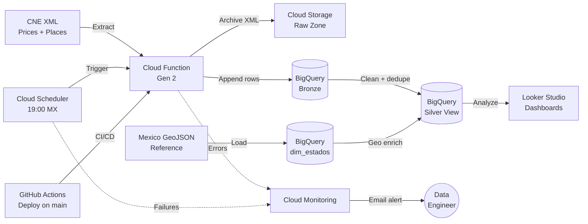

# Mexico Gas Prices — Serverless Data Pipeline


Automated serverless data pipeline that ingests daily gasoline prices from Mexico's **Comisión Nacional de Energía (CNE)**, archives raw XML files, loads append-only **Bronze** tables in **BigQuery**, and exposes a curated **Silver** layer for reporting and analytics.

The solution includes **automated CI/CD**, **observability and alerting**, and **FinOps guardrails** to keep the platform reliable, auditable, and cost-efficient.

---

## Table of Contents

* [Overview](#overview)
* [Architecture](#architecture)
* [Repository Structure](#repository-structure)
* [Core Components](#core-components)
* [CI/CD and Deployment](#cicd-and-deployment)
* [Observability and Alerting](#observability-and-alerting)
* [FinOps and Cost Control](#finops-and-cost-control)
* [Prerequisites](#prerequisites)
* [Local Setup](#local-setup)
* [BigQuery Setup](#bigquery-setup)
* [Manual Alert Deployment](#manual-alert-deployment)
* [Data Quality and Idempotency](#data-quality-and-idempotency)
* [Business Date Logic](#business-date-logic)
* [Future Improvements](#future-improvements)

---

## Overview

This project follows a **Medallion Architecture** implemented with managed Google Cloud services.

| Layer / Area      | Description                                                                            |
| ----------------- | -------------------------------------------------------------------------------------- |
| **Bronze**        | Append-only ingestion tables for raw `prices` and `places` data.                       |
| **Silver**        | Cleaned, deduplicated analytical layer enriched with Mexico state geometry.            |
| **Storage**       | Raw XML files archived in Cloud Storage for replay and auditability.                   |
| **Scheduling**    | Cloud Scheduler triggers the ingestion job daily at `19:00` in `America/Mexico_City`.  |
| **CI/CD**         | GitHub Actions deploys the Gen 2 Cloud Function after changes are merged into `main`.  |
| **Observability** | Cloud Monitoring alerts notify the Data Engineer when the function or scheduler fails. |
| **FinOps**        | BigQuery quotas and billing alerts keep the project within budget.                     |

---

## Architecture

> Note: The diagram uses short labels to avoid text clipping in GitHub's Mermaid renderer.



### End-to-End Flow

1. **Cloud Scheduler** triggers the ingestion process every day.
2. The **Cloud Function** retrieves the `prices` and `places` XML feeds from CNE.
3. Raw files are archived in **Cloud Storage**.
4. Parsed data is appended to **BigQuery Bronze** tables.
5. A reference GeoJSON is transformed into `dim_estados`.
6. The **Silver** view joins, deduplicates, and enriches the data.
7. The final dataset is consumed by **Looker Studio** or other analytical tools.
8. **Cloud Monitoring** alerts the Data Engineer if a function or scheduler failure occurs.

---

## Repository Structure

```text
.
├── .github/
│   └── workflows/
│       └── deploy.yml                # GitHub Actions deployment workflow
├── infra/
│   ├── alerta-funcion.json           # Alert policy for Cloud Function failures
│   └── alerta-scheduler.json         # Alert policy for Cloud Scheduler failures
├── data/
│   ├── reference/
│   │   └── mx-estados.json           # Mexico states GeoJSON reference file
│   └── generated/
│       ├── mx-estados.csv            # Generated CSV from GeoJSON
│       └── mx-estados-validado.csv   # Validated geometry CSV
├── scripts/
│   └── geo/
│       ├── download_wgs84.py         # Downloads the reference GeoJSON
│       ├── geojson_to_csv.py         # Converts GeoJSON to CSV
│       └── validate_wgs84.py         # Validates coordinate ranges
├── sql/
│   ├── 01_dim_estados.sql            # Creates the state dimension table
│   └── 02_vw_silver.sql              # Creates the Silver analytical view
├── main.py                           # Cloud Function entrypoint
└── requirements.txt                  # Python dependencies
```

---

## Core Components

### Cloud Function

| Property           | Value                                       |
| ------------------ | ------------------------------------------- |
| **File**           | `main.py`                                   |
| **Entrypoint**     | `ingest_cne_data`                           |
| **Runtime**        | Python                                      |
| **Responsibility** | Extract, archive, parse, and load CNE data. |

Main responsibilities:

* Determine the business date in `America/Mexico_City`.
* Download the `prices` XML feed.
* Download the `places` XML feed.
* Archive raw XML files in Cloud Storage.
* Parse the XML feeds.
* Append records to Bronze tables in BigQuery.
* Emit logs for monitoring and troubleshooting.

### Geo Preparation Scripts

| Script                          | Purpose                                                                             |
| ------------------------------- | ----------------------------------------------------------------------------------- |
| `scripts/geo/download_wgs84.py` | Downloads the Mexico GeoJSON into `data/reference/mx-estados.json`.                 |
| `scripts/geo/validate_wgs84.py` | Validates geometry coordinates and writes `data/generated/mx-estados-validado.csv`. |
| `scripts/geo/geojson_to_csv.py` | Converts the GeoJSON into `data/generated/mx-estados.csv`.                          |

### SQL Layer

| File                     | Purpose                                                       |
| ------------------------ | ------------------------------------------------------------- |
| `sql/01_dim_estados.sql` | Creates the `dim_estados` reference table in BigQuery.        |
| `sql/02_vw_silver.sql`   | Creates the deduplicated and enriched Silver analytical view. |

---

## CI/CD and Deployment

Deployments are automated through **GitHub Actions**.

Any push or merge into the `main` branch can trigger the deployment workflow, especially when modifying:

* `main.py`
* `requirements.txt`
* `.github/workflows/deploy.yml`

### Required GitHub Repository Secret

| Secret       | Description                                                       |
| ------------ | ----------------------------------------------------------------- |
| `GCP_SA_KEY` | JSON credentials for the Google Cloud deployment service account. |

### Required IAM Roles

| IAM Role                                     | Purpose                                                     |
| -------------------------------------------- | ----------------------------------------------------------- |
| `Cloud Functions Developer`                  | Deploy and manage Cloud Functions.                          |
| `Service Account User`                       | Allow deployments to run using the runtime service account. |
| `Artifact Registry Repository Administrator` | Manage build artifacts and container images.                |
| `Cloud Run Admin`                            | Manage the Cloud Run service backing the Gen 2 function.    |

---

## Observability and Alerting

The project uses **Google Cloud Monitoring** to detect failures and notify the Data Engineer by email.

| Alert                       | File                          | Description                                                                      |
| --------------------------- | ----------------------------- | -------------------------------------------------------------------------------- |
| **Function Error Alert**    | `infra/alerta-funcion.json`   | Monitors `cloud_run_revision` logs and alerts on runtime or ingestion errors.    |
| **Scheduler Failure Alert** | `infra/alerta-scheduler.json` | Monitors `cloud_scheduler_job` logs and alerts when the scheduled trigger fails. |

Typical failure scenarios:

* CNE endpoint unavailable.
* Unexpected XML schema changes.
* Cloud Function runtime exception.
* BigQuery load failure.
* Cloud Scheduler execution failure.

---

## FinOps and Cost Control

This solution is designed to stay within the **Google Cloud Free Tier** under normal usage.

| Control                      | Description                                                                                        |
| ---------------------------- | -------------------------------------------------------------------------------------------------- |
| **BigQuery Query Quota**     | Query usage per day is capped at approximately `50 GiB/day` (`0.05 TiB`).                          |
| **Billing Budget Alert**     | A project budget of **$5.00 USD/month** sends alerts at **50%**, **90%**, and **100%** thresholds. |
| **Serverless Runtime**       | Compute costs are minimized because the function only runs on demand.                              |
| **Raw Archive Partitioning** | Raw files are stored using organized paths to simplify replay and limit unnecessary processing.    |

---

## Prerequisites

Before running this project, make sure you have:

* **Python 3.9+**
* **Google Cloud SDK** installed and authenticated
* Access to a Google Cloud project with these services enabled:

  * Cloud Functions
  * Cloud Scheduler
  * Cloud Storage
  * BigQuery
  * Cloud Monitoring

---

## Local Setup

### macOS / Linux

```bash
python3 -m venv venv
source venv/bin/activate
pip install -r requirements.txt
```

### Windows

```powershell
python -m venv venv
venv\Scripts\activate
pip install -r requirements.txt
```

---

## BigQuery Setup

1. Load the generated or validated geometry CSV into a staging table in BigQuery.
2. Run `sql/01_dim_estados.sql` to create `dim_estados`.
3. Run `sql/02_vw_silver.sql` to create the Silver view.

> The SQL scripts currently reference the project `cne-pipeline-mx-2026`. Update those identifiers if you deploy to a different Google Cloud project.

---

## Manual Alert Deployment

```bash
gcloud alpha monitoring policies create --policy-from-file="infra/alerta-funcion.json"
gcloud alpha monitoring policies create --policy-from-file="infra/alerta-scheduler.json"
```

---

## Data Quality and Idempotency

* Raw XML is archived **before** parsing.
* Bronze tables follow an **append-only** ingestion pattern.
* The Silver layer removes duplicates using `ROW_NUMBER()`.
* Invalid prices can be filtered out in the analytical layer.
* Geographic enrichment only uses records with valid coordinate data.

These controls make the pipeline easier to audit, replay, and troubleshoot.

---

## Business Date Logic

The ingestion logic uses the `America/Mexico_City` timezone to determine the correct business date.

This is important because the source system may publish data after a certain time of day. Handling the business date correctly ensures that the pipeline loads the expected daily snapshot.

---

## Future Improvements

* Add a **Gold layer** for KPI-ready business metrics.
* Add **unit tests** and **integration tests** for XML parsing and transformation logic.
* Store deployment configuration in **Terraform** or another Infrastructure as Code framework.
* Add **data validation checks** with Great Expectations or similar tooling.
* Add **dashboard examples** in Looker Studio.
* Add **station geolocation enrichment** to support map-based analysis across Mexico.

---

## Summary

This project demonstrates a production-style, serverless ingestion pipeline built on Google Cloud. It combines automated ingestion, managed infrastructure, structured analytical layers, CI/CD, monitoring, alerting, and cost governance.
